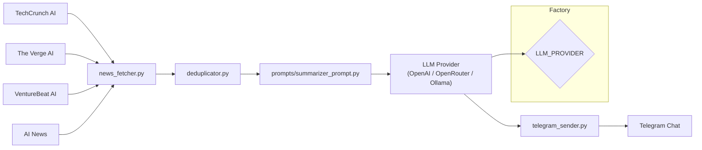

# AI News Intelligence Agent

Automate your AI news briefing. Fetches the latest articles from top AI RSS feeds, summarises them with an LLM of your choice, and delivers a structured English briefing to your Telegram.

## Features

- **Multi-source RSS aggregation** — TechCrunch AI, The Verge AI, VentureBeat AI, Artificial Intelligence News
- **Smart deduplication** — removes duplicates by lowercase title before summarisation
- **Provider-agnostic LLM layer** — swap between OpenAI, OpenRouter, and Ollama with one env var
- **Per-article intelligence analysis** — impact score, category, mentioned companies, target audience, and build opportunities
- **Structured English briefing** — key developments, analysis, opportunities, risks, sources
- **Telegram delivery** — automatic message splitting (handles >4096 chars)
- **Scheduled or manual execution** — daily at 06:00 UTC via GitHub Actions, with `workflow_dispatch` fallback
- **Docker support** — run anywhere with a single `docker run` command
- **CI/CD** — automated tests on every push via GitHub Actions

## Tech Stack

| Layer          | Technology                        |
|----------------|-----------------------------------|
| Language       | Python 3.12                       |
| RSS Parsing    | `feedparser`                      |
| LLM SDK        | `openai` (OpenAI / OpenRouter)    |
| Local LLM      | Ollama REST API                   |
| Messaging      | Telegram Bot API via `requests`   |
| Config         | `python-dotenv`                   |
| Container      | Docker (slim bookworm)            |
| CI/CD          | GitHub Actions                    |
| Testing        | pytest                            |

## Architecture



## Project Structure

```
app/
├── core/                  # Config, logging, custom exceptions
│   ├── config.py
│   ├── logger.py
│   └── exceptions.py
├── llm/                   # LLM provider abstraction
│   ├── base.py            # Abstract LLMProvider
│   ├── factory.py         # Provider factory
│   ├── openai_provider.py
│   ├── openrouter_provider.py
│   └── ollama_provider.py
├── models/                # Domain models
│   └── article.py         # Article dataclass
├── prompts/               # Prompt templates
│   └── summarizer_prompt.py
├── services/              # Business logic
│   ├── news_fetcher.py
│   ├── summarizer.py
│   ├── telegram_sender.py
│   └── deduplicator.py
└── main.py                # Entry point

docs/
├── architecture.md
├── development.md
├── roadmap.md
└── security.md

tests/
└── test_deduplicator.py
```

## Installation

### Local

```bash
git clone https://github.com/yourusername/ai-news-intelligence-agent.git
cd ai-news-intelligence-agent

python -m venv venv
source venv/bin/activate   # Windows: venv\Scripts\activate

pip install -r requirements.txt
```

### Docker

```bash
docker build -t ai-news-agent .
docker run --env-file .env ai-news-agent
```

## Telegram Bot Setup

1. Open Telegram and search for [@BotFather](https://t.me/BotFather).
2. Send `/newbot` and follow the prompts.
3. Copy the API token you receive.
4. Start a chat with your new bot and send any message.
5. Visit `https://api.telegram.org/bot<YOUR_TOKEN>/getUpdates` to find your `chat_id` (look for the `chat` object &rarr; `id` field).

## Environment Variables

Copy `.env.example` to `.env` and fill in your values.

| Variable             | Required               | Default                  | Description                          |
|----------------------|------------------------|--------------------------|--------------------------------------|
| `LLM_PROVIDER`       | Yes                    | `openai`                 | LLM backend (`openai`, `openrouter`, `ollama`) |
| `MODEL`              | Yes                    | `gpt-4.1-mini`           | Model name                           |
| `OPENAI_API_KEY`     | If provider is `openai` | –                        | OpenAI API key                       |
| `OPENROUTER_API_KEY` | If provider is `openrouter` | –                    | OpenRouter API key                   |
| `OLLAMA_BASE_URL`    | No                     | `http://localhost:11434`  | Ollama server URL                    |
| `TELEGRAM_BOT_TOKEN` | Yes                    | –                        | Telegram bot token                   |
| `TELEGRAM_CHAT_ID`   | Yes                    | –                        | Target chat ID                       |

## Usage

```bash
# Local
python run.py

# Docker
docker build -t ai-news-agent .
docker run --env-file .env ai-news-agent
```

The script will:

1. Validate your configuration.
2. Fetch articles from all RSS feeds.
3. Deduplicate and prompt the LLM.
4. Send the structured briefing to Telegram.

## Running Tests

```bash
python -m pip install pytest       # ensure pytest is installed
python -m pytest tests/ -v
```

## GitHub Actions

### Daily Schedule (`.github/workflows/daily-news.yml`)

Runs automatically at **06:00 UTC** every day. Can be triggered manually via the Actions tab.

Set the following secrets in **Settings → Secrets and variables → Actions**:

| Secret                 | Required               |
|------------------------|------------------------|
| `LLM_PROVIDER`         | Yes                    |
| `MODEL`                | Yes                    |
| `OPENAI_API_KEY`       | If provider is `openai` |
| `OPENROUTER_API_KEY`   | If provider is `openrouter` |
| `OLLAMA_BASE_URL`      | No                     |
| `TELEGRAM_BOT_TOKEN`   | Yes                    |
| `TELEGRAM_CHAT_ID`     | Yes                    |

### CI (`.github/workflows/ci.yml`)

Runs `pytest` on every push and pull request to `main`.

## Security

**.env contains sensitive credentials. Never commit it to version control.**

- `.env` is in `.gitignore` by default.
- See [`docs/security.md`](docs/security.md) for what to do if you accidentally push a key.

## Roadmap

- [x] Multi-source RSS + deduplication
- [x] Provider-agnostic LLM layer (OpenAI, OpenRouter, Ollama)
- [x] Telegram delivery with message splitting
- [x] Scheduled execution via GitHub Actions
- [x] Docker support
- [x] CI pipeline with automated tests
- [ ] Anthropic Claude provider
- [ ] Google Gemini provider
- [ ] Groq provider
- [ ] Configurable RSS feed list
- [ ] CLI flags (`--once`, `--watch`)

## Contributing

1. Fork the repository.
2. Create a feature branch (`git checkout -b feature/my-feature`).
3. Commit your changes (`git commit -m 'Add my feature'`).
4. Push to the branch (`git push origin feature/my-feature`).
5. Open a Pull Request.

Please ensure tests pass before submitting.

## License

MIT
